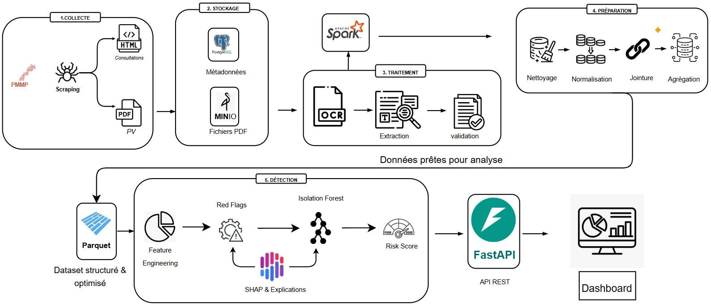
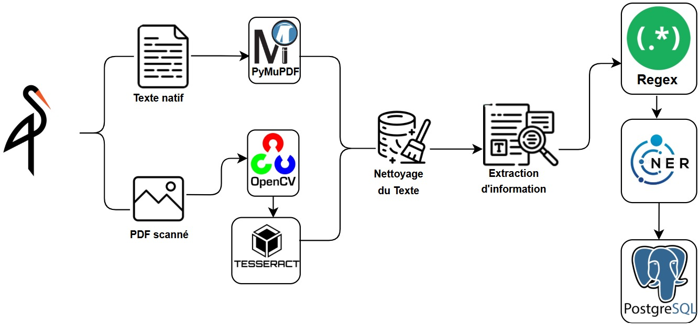
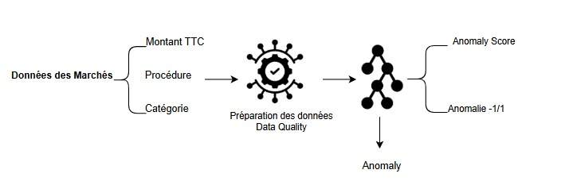
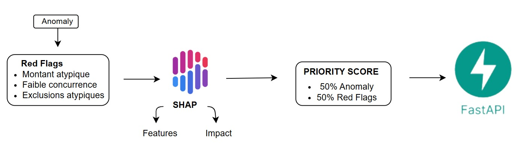
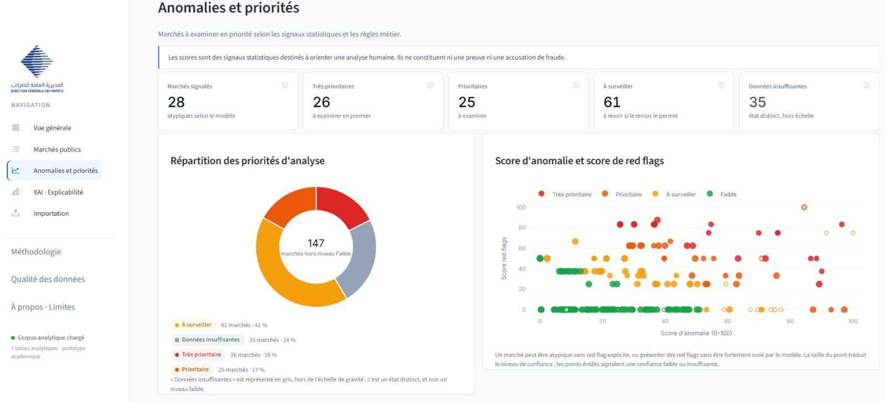
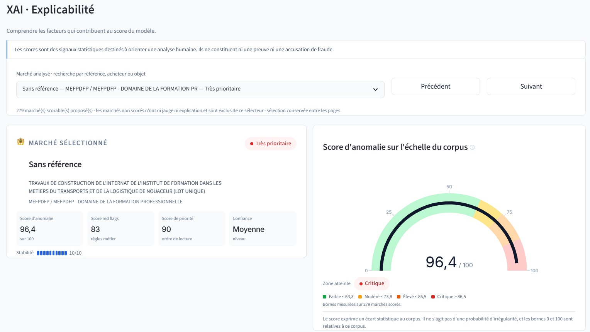

# PMMP — Analyse des marchés publics marocains

> **Projet académique — prototype.** Non déployé, à but pédagogique.

454 marchés publics marocains collectés depuis le
[Portail Marocain des Marchés Publics](https://www.marchespublics.gov.ma/),
océrisés, structurés puis analysés pour répondre à une seule question :
**quels marchés méritent un examen humain en priorité, et pourquoi ?**
Jamais : « ce marché est-il frauduleux ? ».

L'unité d'analyse est le **marché** (un lot attribué), pas l'entreprise — voir
[`docs/refonte_marche.md`](docs/refonte_marche.md) pour l'historique de cette
bascule.

## Le pipeline, étape par étape

5 étapes : **Collecte** (scraping PMMP) → **Stockage** (PostgreSQL + MinIO) →
**Traitement** (OCR + extraction) → **Préparation** (nettoyage/normalisation
PySpark) → **Détection** (features → red flags → Isolation Forest → score) →
exposé par **FastAPI** → affiché dans le **dashboard**.

### 3. Traitement — OCR et extraction

Deux chemins selon le type de PDF : **texte natif** → `PyMuPDF` ; **PDF
scanné** → `OpenCV` (prétraitement d'image) → `Tesseract` (`fra+ara`). Puis
nettoyage du texte → extraction par **regex** → **NER** → `PostgreSQL`.

### 4. Préparation — nettoyage et agrégation PySpark

`PostgreSQL` → `Spark` → nettoyage (doublons, correction OCR, valeurs
manquantes) → normalisation (dates, montants, noms, catégories) → jointure
consultations/PV via `refConsultation` → enrichissement → agrégation →
vérification → export `Parquet`.

### 5. Détection — des features au score

`Parquet` → features pertinentes (`nb_soumissionnaires`, taux d'exclusion,
montant TTC) → red flags (faible concurrence, exclusions atypiques, montant
atypique) → normalisation → matrice prête pour le modèle.

Les features passent par un contrôle qualité puis par un **Isolation
Forest**, qui produit un `Anomaly Score` et un label (-1/1).

Le **score de priorité final = 50 % Anomaly Score + 50 % score de Red
Flags**, expliqué par **SHAP** (facteurs + impact), exposé par **FastAPI**.

Détail commande par commande pour tout reproduire :
[`docs/onboarding.md`](docs/onboarding.md).

## Les red flags métier

| Code | Signal | Ce qu'il détecte |
|---|---|---|
| RF01 | Faible concurrence | Un seul soumissionnaire identifié |
| RF02 | Exclusions atypiques | Part de concurrents écartés dans le quintile supérieur du corpus |
| RF03 | Montant atypique | Montant attribué dans les 5 % les plus élevés du corpus |
| RF05 | Procédure rare | Mode de passation peu fréquent dans le corpus |
| RF06 | Signaux multiples | Au moins deux red flags primaires actifs simultanément (dérivé, ne compte pas dans le score) |

## Explicabilité (XAI)

Chaque score est **doublement validé** : les facteurs SHAP sont comparés à un
**contrôle par ablation** (chaque variable neutralisée à la médiane, un
classement indépendant recalculé) — sur le corpus actuel, les deux méthodes
s'accordent à **100 %** sur le Top 3 des facteurs.

Chaque marché scoré est comparé à ses pairs (même catégorie, même procédure,
même année) avec une explication en langage simple. Un analyste peut
enregistrer un avis (pertinent / faux positif / à examiner), tracé dans
`data/reference/analyst_reviews.csv` sans jamais modifier le modèle.

## Le dashboard, en capture

**454** marchés collectés (314 attribués, 140 infructueux), **279**
scorables, **28** atypiques signalés, qualité moyenne des données **60/100**.
Répartition par année : 126 (2023) · 104 (2024) · 106 (2025) · 118 (2026, en
cours).

Table filtrable des 454 marchés : référence, objet, acheteur, procédure,
montant TTC, priorité, qualité, red flags.

Sur 147 marchés hors niveau Faible : 26 très prioritaires, 25 prioritaires,
61 à surveiller, 35 à données insuffisantes.

Exemple : un marché avec score d'anomalie 96,4/100 (zone critique), score de
red flags 83, score de priorité 90, stabilité 10/10 sur 279 marchés scorés.

**Rappel affiché sur chaque page du dashboard** : *« Les scores sont des
signaux statistiques destinés à orienter une analyse humaine. Ils ne
constituent ni une preuve ni une accusation de fraude. »*

- Dashboard : https://public-procurement-intelligence.streamlit.app/

